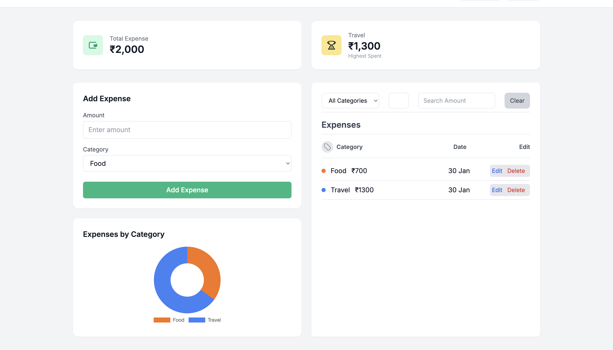

# 💸 Expense Tracker Dashboard (Vanilla JavaScript)

A fully functional **Expense Tracker Dashboard** built using **Vanilla JavaScript**, focused on strengthening core frontend fundamentals like DOM manipulation, state management, and clean UI logic — without relying on frameworks.

This project was intentionally built without React to deeply understand how real-world apps work under the hood.

## 📸 Dashboard Preview

## 🚀 Features

### Core Functionality
- Add, Edit, Delete expenses
- Category-based expense tracking
- Real-time UI updates via re-rendering
- Clean dashboard-style UI

### Insights & Analytics
- Total Expense calculation
- Top Category (highest spending)
- Donut chart for category-wise spending (Chart.js)

### Filters
- Filter by category
- Filter by date
- Filter by amount
- Clear all filters instantly

### Monthly Data Separation
- Expenses are grouped automatically by **month & year**
- January data is stored separately from February, March, etc.
- Old months’ data remains preserved
- Only the current month’s data is editable

### Persistence
- Data is stored using **browser localStorage**
- Expenses persist across page reloads and browser restarts

## 🧱 Tech Stack & Philosophy

- **HTML** → Structure only  
- **CSS / Tailwind (HTML-only)** → Styling & layout  
- **JavaScript (Vanilla)** → All logic  
- **Chart.js** → Visualization only  

❌ No frameworks 
❌ No external state libraries   

Clean separation of concerns was strictly followed.

## 🧠 Key Concepts Learned

- DOM creation & re-render cycles
- State-driven UI updates
- Reattaching event listeners after re-render
- Using `data-*` attributes to link DOM with state
- Handling filtered views with correct indexing
- Browser storage using `localStorage`
- Structuring data by time (month/year)
- Dashboard layout best practices
- Avoiding fixed-height UI issues

## 🛠️ How It Works (High Level)

- Expenses are stored as objects inside an array
- Monthly data is stored using keys like `YYYY-MM`
- UI is rendered from state (single source of truth)
- Totals, top category, and chart update automatically on any change

## 🧪 Future Improvements

- Month & year selector to view past months
- Read-only mode for old months
- Export expenses as CSV
- Mobile-first polish
- React rebuild for comparison

## 🎯 Purpose of This Project

This project was built to:
- Strengthen **Vanilla JavaScript fundamentals**
- Build intuition before moving to React
- Practice solving real-world UI and state problems
- Avoid tutorial-style shallow coding

## 👤 Author

**Pranay Sharma**  
B.Tech Student
Building in public 🚀
